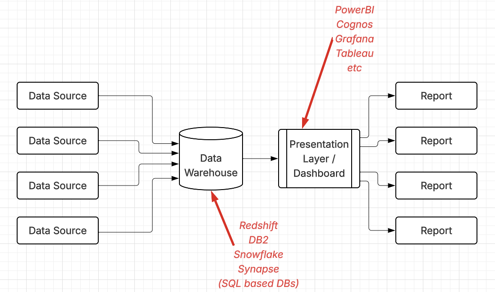
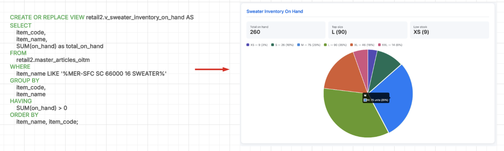
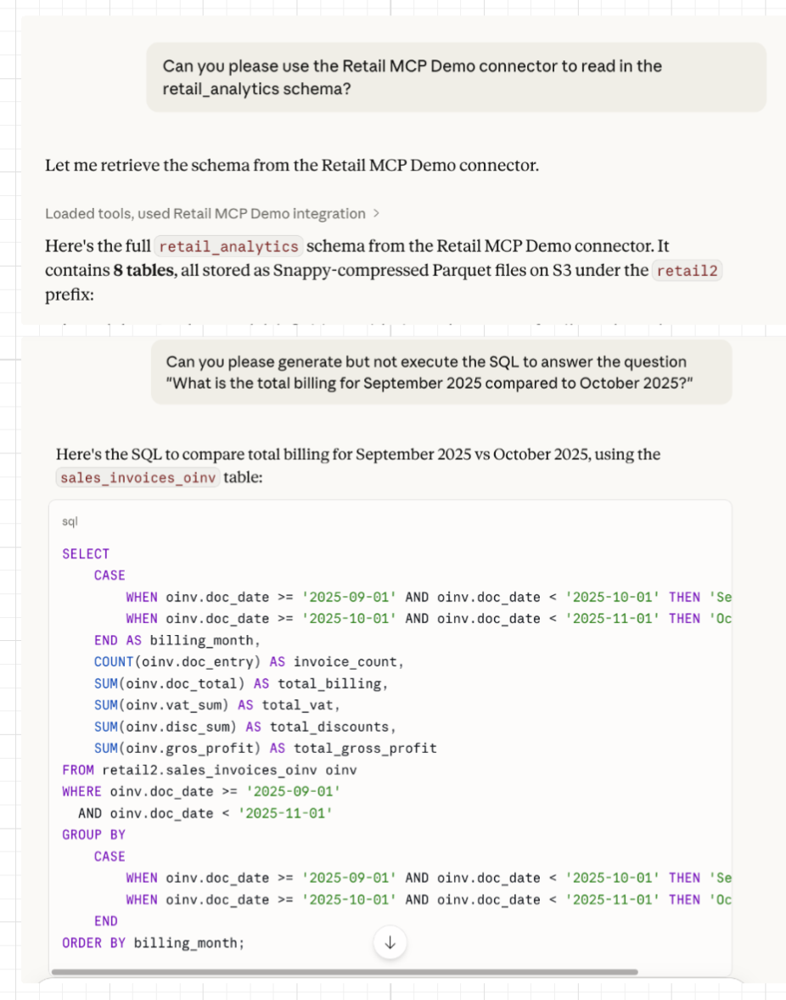
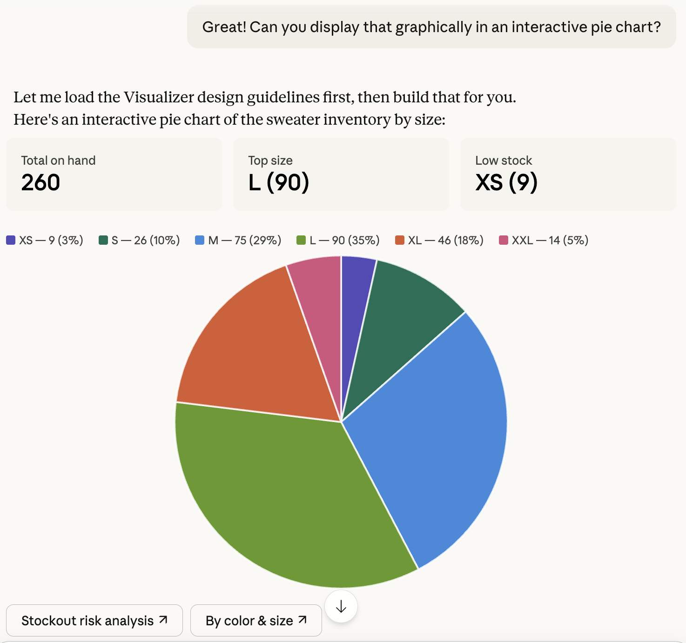
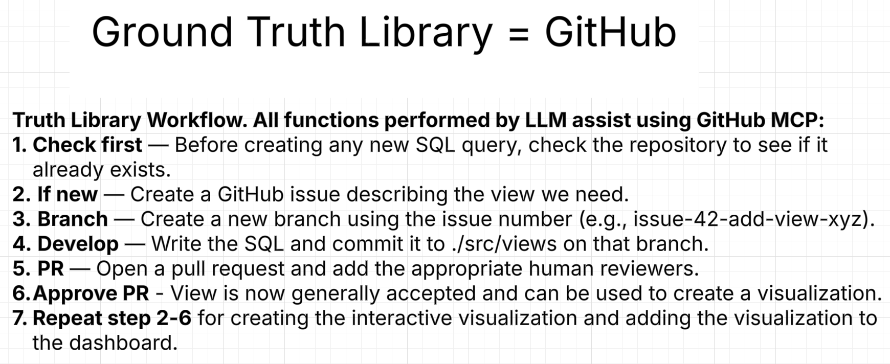
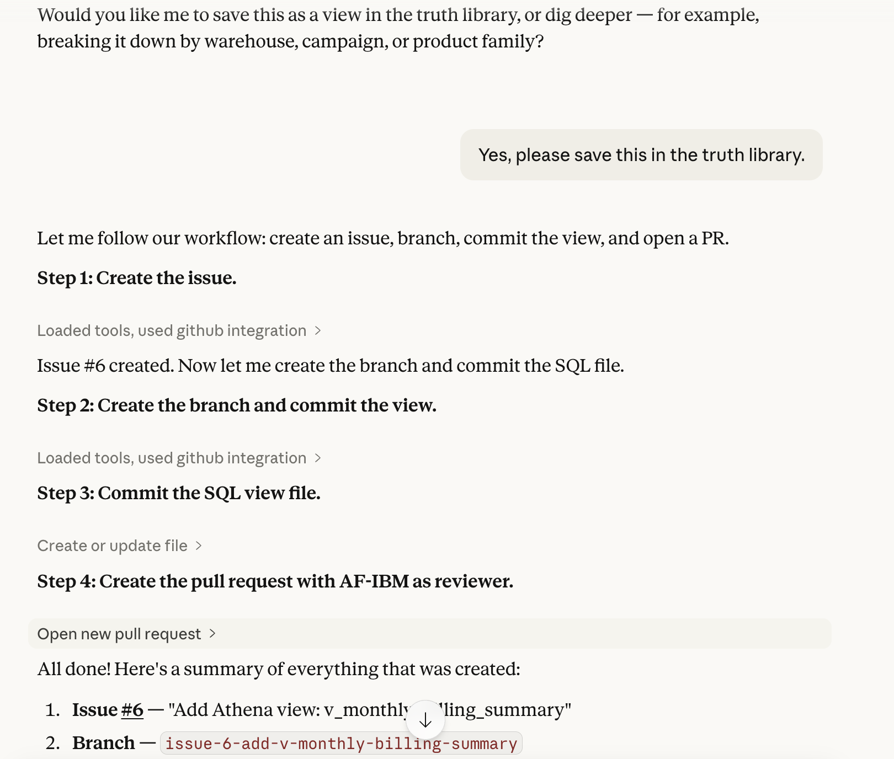
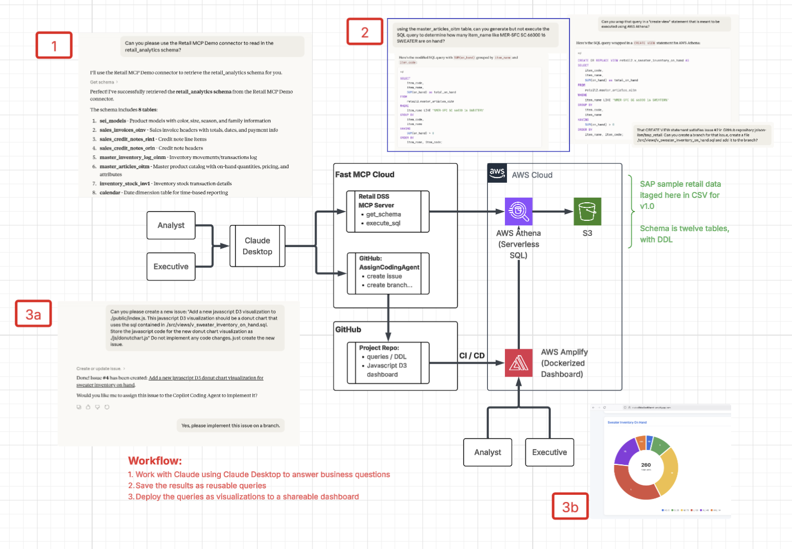

# retail-analytics

This repository is meant to present a reference architecture and a reference implementation demonstrating the use of Generative AI (GenAI) for decision support analytics in the retail space.

## Current State of Decision Support Analytics

A very common pattern for decision support is aggregating data from several sources, such as point-of-sale, inventory control or supply chain systems into a central enterprise data warehouse, such as Amazon RedShift, IBM DB2, Snowflake, or Microsoft Synapse. From there, a presentation layer can be built and published using any commerical analytics package, such as Micorosoft PowerBI, IBM Cognos, Tableau or Grafana:

Using this model, a staff of business analysts can use their understanding of the enterprise data model and SQL to create views which can then be used to power interactive visualizations using the presentation layer to aid in decision support:

The current decision support workflow:

1. Developing key performance indicators (KPIs) or implementing KPIs based on requirements handed down from other business groups.
2. Implementing those KPIs using SQL against the enterprise data model.
3. Implementing the visualizations based on the SQL in the presentation layer.

## Possible Future Direction Enabled By GenAI

Many LLM based tools, such as Anthropic's Claude Code or Microsoft's CoPilot have demonstrated the ability to assist with coding. In this case, the coding is very specialized - transforming natural language KPI definitions into SQL using the enterprise data model as input. The following examples use Claude Desktop and the supported Opus4.6 model:

Similarly, another very specialized set of GenAI assisted coding: Javascript D3 widgets generated using SQL views:

## Two Considerations

Anybody that has ever worked in decision support has been confronted with the dreaded question "Why don't these two reports match?". The unpredictability of GenAI does not lend itself naturally to decision support, as the same KPI posed using natual language may generate different results at different times.

To combat this, the idea of "ground truth" is introduced. Queries and views are developed with GenAI code assist, but are treated as version controlled artifacts that go through a normal review process. In the reference architecture, GitHub can be used as the truth repository, and a simple GenAI workflow can built around it:

Example of the workflow in action:

The second consideration: in a retail scenario, can natural language map to exact items or groups of items in the enterprise item hierarchy? An additional data structure - one that helps the LLM map natural language to actual items in the item hierarchy is needed, and will be added to this project demonstrating how this might be addressed in a production environment.

## Reference Implementation

This leads to a reference architecture that anyone can build out using Amazon Web Services (AWS):

A very inexpensive data warehouse can be simulated using AWS Athena - a serverless SQL engine that only incurrs a job based on how much data is being read. At idle, there is no charge.

Test data can be loaded directly into S3 as .csv files. SAP has open sourced [several test data sets under their Datasphere brand](https://github.com/SAP-samples/datasphere-content/tree/main).

S3 and Athena can be set up easily using the [AWS Cloud Development kit (CDK)](https://aws.amazon.com/cdk/) infrastructure-as-code found in this repository. The root of this is in `./iac/aws/iac`. This consists of several stacks used to build out the project artifacts:
    1. **datalake_stack**: A set of S3 buckets in `us-east-1` and `us-east-2` used for storing the `.csv` files.
    2. **scratch_stack**: A second set of S3 buckets with a very short retention policy used for the AWS Athena query output.
    3. **analytics_stack**: This creates an AWS Athena database, and loads the schema on top of each set of `.csv` files.
    4. **access_stack**: This creates an AWS IAM user that can be used as a service account to execute queries against AWS Athena.  

A very simple MCP server using the Python FastMCP is included in `./src/src/retail_analytics_server.py` This MCP server defines two tools:
    1. **get_schema** - this returns the DDL for the test schema to the LLM context
    2. **execute_sql** - this will execute an Athena SQL statement and return the results to the context 

This MCP server can be deployed directory from the project repository using [Prefect.io](https://horizon.prefect.io/). Since it is a non-production project, it can be deployed for free.

The MCP server will need six environment variables to deploy on **Prefect.io** properly:
1. **AWS_ACCESS_KEY_ID** - From the service account created in the `access_stack` 
2. **AWS_SECRET_ACCESS_KEY**  - From the service account created in the `access_stack`
3. **ANALYTICS_BUCKET** - From the S3 bucket created in the `datalake_stack` above 
4. **AWS_REGION** - If the default settings are used in th CDK deployment above, this should be `us-east-2`
5. **ANALYTICS_OUTPUT_BUCKET**  - From the S3 bucket created in the `scratch_stack` above
6. **RETAIL_DATABASE_NAME** - The Athena database created in the `analytics_stack` above. 

If deployed properly, Prefect.io will provide an endpoint to the server, which you can then easily plug in to Claude desktop using the 'Connectors' context menu.

The second MCP server is the general GitHub MCP server. If this is plugged into Claude, it will allow claude to create issues, add new code to branches, and create pull request which can be assigned to human reviewers.

The final component is a simple Javascript D3 dashboard, which can be deployed as an [AWS Amplify](https://aws.amazon.com/amplify/) application. This can be found under `./ui`. The deployment to Amplify is just as simple as the deployment to Perfect.io - point it at the repository, and AWS Amplify will handle all the deployment details, including when the application in the repository is updated. 

## Putting It All Together

In this GenAI code assist future, "build" vs "buy" might be swung back into "build". Non-technical people - such as executives or senior managers may be able to contribute at a higher level, rather than waiting for the analysts to start a full development cycle. Higher skilled analysts might be deployed on higher value projects, rather than being relegated to SQL and dashboard work.  
